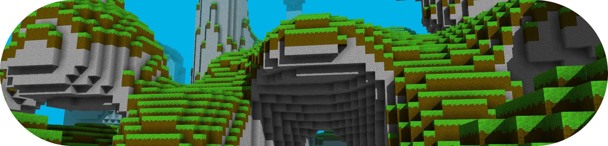

# Qwy2 - A wannabe Minecraft-like game

<p align="center"></>

Very early alpha indev work-in-progress v0.0.0 state, there is not much to see yet. For now all you can do here is move around in a voxel world and place/remove blocks.

## Build and run on Linux

### Dependencies

For now, Qwy2 depends on [GLM](http://glm.g-truc.net/0.9.8/index.html) (`libglm-dev`) and [SDL2](https://www.libsdl.org/download-2.0.php) (`libsdl2-dev`).

Qwy2 uses the [OpenGL](https://www.khronos.org/opengl/wiki/FAQ#What_is_OpenGL.3F) 4.3 graphics API, there should be nothing to install on Linux for this (except maybe some drivers in case the game does not work). [GLEW](http://glew.sourceforge.net/) (a cross-platform OpenGL extension loader) can be linked and used in Qwy2, but this is disabled by default, and Qwy2 does not make use of OpenGL extensions (and does not plan to), thus this is not a dependency.

Qwy2 is a [C++17](https://en.cppreference.com/w/cpp/compiler_support/17) project that uses the C++ standard library, which is thus a dependency (an implementation of which should be installed by default, but in case it is not then any recent implementation should do).

C++ compilers tested and supported by the build system include [GCC](https://gcc.gnu.org/) (`g++`) and [Clang](https://clang.llvm.org/) (`clang`). The build system is written in [Python 3](https://www.python.org/downloads/) (`python3`) (Python 3.9 or higher should do (but not older versions as this script uses some dictionary operators added in 3.9), it was out in 2020 so it seems reasonable).

The building process has only been tested on Linux (Ubuntu 18.04 LTS) yet, it is likely to fail on very different systems for now.

### Build

The build system is in the `buildsystem` Python 3 package and can be invoked with the `bs.py` Python script.

For a *release build*, simply run it:

```sh
python3 bs.py
```

It can take some command line arguments such as `-d` for a *debug build*. Use `-h` instead to get a help message containing the possible arguments.

The compiled binary will be `bin/Qwy2`, build artifacts will be in the `build` directory.

### Build and run

The `-l` command line argument given to `bs.py` will make it run the compiled binary (from `bin`) if the compilation is successful, and arguments that follow `-l` are forwarded to the compiled binary.

Thus the most useful command during development is the following:

```sh
python3 bs.py -l
```

### Clearing build artifacts

If the build system breaks or something, `--clear` is the way to go, the great eraser:

```sh
python3 bs.py --clear --dont-build
```

## The game

It is in a so early state that everything is subject to change anytime soon.

### Controls

At the time of writing this README (that may not be quite kept in sync with the changes made to Qwy2), I have hardcoded some of my personal Minecraft controls, which is why *jumping is right-click* (don't ask), and forward/left/backward/right is ZQSD (AZERTY keyboard). This should change in the (near?) future and be configurable! The rest of the controls can be found either by searching the event loop in the source code or by trying all the keys (keys that have an effect on settings will result in some message being printed, that should help).

The A key and Left Click can be used to place and remove blocks.

### What this project will become (if my motivation does not disappear into the void too soon)?

<details>
<summary>Bottom text</summary>

Minecraft is very cool, but like all games that generate the world (or anything) procedurally, we eventually grow accustomed to what does not change (the block types, the biomes, the entities, the interface, etc.). I used to install a lot of mods to add content to the world generation, new entities, etc. to keep alive the possibility of discovering new content when exploring and experimenting. This is what turns me on: discovering new, unexpected stuff. Qwy2 is meant to eventually get a powerful procedural generation that will be able to generate new biome types, new block types, new entities, new laws of physics, new dimensions, new structures, new items, etc. Imagine how cool would that be! Obviously, some stuff would sill have to be hardcoded, but I want the hardcoded border to be one level farther than Minecraft's about a lot of in-game concepts to make Qwy2 worlds and parts of worlds feel more unique.
</details>

Also the build height limits are extremely frustrating, so Qwy2 has infinite world generating in all 3 axis (6 directions).

Note: For now, these are nothing more than hopes and dreams that everyone could have. I hope the Force will help me keep focusing on this project until these become fully implemented features!

A [TODO list](TODO.md) is available and contains some entries for both short-term implementation details as well as long-term dream features.

## FAQ

### Why C++? Why not in Rust?!

I know I know. Don't get me wrong: Rust is awesome. But I need to know C++ better to get more precise arguments against it. If there is ever a Qwy3, it will be in Rust.

### Why C++17? Why not C++20 or even newer?!

I know I know. Don't get me wrong: C++20 seems better than C++17. But the language server that my setup uses crashes when certain features of C++20 are used... It is probably too young for proper tooling, and C++17 is good enough for now. (This was written in April 2022.)

### Why OpenGL? Why not Vulkan?!

I know I know. Don't get me wrong: Vulkan seems awesome and will probably slowly but surely replace OpenGL in the years to come (it seems this process is already on its way). But right now I don't know Vulkan. When this changes, Vulkan support will probably be added to Qwy2. it could be neat to have a support for both.

### Why the SDL2? Why not something else?!

I know I know. Don't get me wrong: something else could be awesome too. But I feel comfortable with the SDL2. At some point, it could be cool to also support native window handling APIs.

### Why a custom build system written in Python? Why not CMake?!

I know I know. Don't get me wrong: CMake is awesome. Wait, no, I disagree here. Although a subjective (but somewhat popular) opinion, I dislike CMake to a point where I prefer a custom-made build system. Maybe everything that the build system here does could be done via CMake with less effort, but I don't know about that. Maybe, in the future, if a lot of people complain about CMake not being the build system here, then maybe, maybe, it will be supported as a plan-B build system, maybe. Maybe not.

### Why Python? Why not Bash/Ruby/Pearl/JavaScript/Befunge-93/whatever?!

I know I know. Don't get me wrong: [Befunge-93](https://youtu.be/dQw4w9WgXcQ) is awesome. But I am more comfortable in Python 3, and it is quite widespread. People are likely to have it installed or install it easily, and know enough of it to fix/adapt the build system if needed.

### Why tabs? Why not 4 spaces?!

I know I know. Don't get me wrong: 4 spaces are the most widely used convention out there, so much so that it is the default for the Rust formatter. But I don't care, we could talk about this for hours, in the end it does not matter, just configure your IDE or something. I feel more comfortable with tabs.

## FAQ - Part 2

### What to expect from this project?

I don't even know. On the one hand, I have abandoned many projects in the past, on the other hand, "making Minecraft" was pretty much what had me started programming 10 years ago. Now that I have the power to do it, I would be a shame to not do it.

### Reporting a bug or an issue, suggesting a feature, etc.?

Sure sure go ahead and post an issue!

### Contributing?

Well I dunno, bug fixes are welcome, but this project is kinda my dream project. I want to be able to show this repo as an achievment, and I have some strong visions about what this should become.

Feel free to clone/fork it and do your stuff, and we can talk about cool ideas, that is for sure!

### License?

[Apache License 2.0](LICENSE)

Pretty permissive. It is like the MIT license, but different. Harder to read, but there are [plenty of](https://www.whitesourcesoftware.com/resources/blog/top-10-apache-license-questions-answered/) [explanations](https://fossa.com/blog/open-source-licenses-101-apache-license-2-0/) [of what it says](https://en.wikipedia.org/wiki/Apache_License). Basically (if I understand correctly): you can do what you want with this project, the modifications are to be summed up somewhere with a copy of the license, don't sue me, can be sold, etc.

Unless stated otherwise, the code and assets in this repo are original work to which this license applies. If code or specific algorithms are "stolen", the source would be mentionned in comments. Feel free to steal bits of code too, its open source after all!

### If this is Qwy2, it means there was a Qwy1 before, right?

Yep, [here](https://github.com/anima-libera/qwy), but it is quite dusty by now. It died due to not enough time and me being not powerful enough at the time (I mean, look at the code, ugh..).

Basically Qwy1 does not exist, and the story starts at Qwy2. Like Python.

### Do you know about this other Minecraft-like stuff?

Probably haha. I mean maybe not, there are so many of them. If you are intrested in Minecraft-likes, you should keep an eye on [Hytale](https://hytale.com/) (read all their blog entries!), it looks extremely cool (but only exists in the future, for now).

Here are some YouTube channels *of interest*, some of them have done devlogs on Minecraft-likes:

- [Hopson](https://www.youtube.com/c/Hopsonn)
- [jdh](https://www.youtube.com/c/jdhvideo)
- [GamesWithGabe](https://www.youtube.com/c/GamesWithGabe) (also on Twitch)
- [Henrik Kniberg](https://www.youtube.com/c/henrikkniberg) (Minecraft dev!!)
- [Gabe Rundlett](https://youtube.com/channel/UCTceODz7ynphUfT8QnFduZQ)

Here are some GitHub repos of Minecraft-likes, (not looked at the code in detail yet, might steal multiplayer stuff some day):

- [Minetest](https://github.com/minetest/minetest) (C++, [Irrlicht](https://irrlicht.sourceforge.io/?page_id=45), big projet)
- [Terasology](https://github.com/MovingBlocks/Terasology) (Java, seems big too)
- [A Tiny Minecraft Clone](https://github.com/swr06/Minecraft) (C++, Modern OpenGL)
- [Craft](https://github.com/fogleman/Craft) (C, Modern OpenGL)
- [AltCraft](https://github.com/LaG1924/AltCraft) (C++, Modern OpenGL)
- [Freeminer](https://github.com/freeminer/freeminer) (C++, [Irrlicht](https://irrlicht.sourceforge.io/?page_id=45), medium?)
- [ClassiCube](https://github.com/UnknownShadow200/ClassiCube) (C, OpenGL 1 and 2 and Direct3D 9 and 11)
- [Minecraft-Clone](https://github.com/Aidanhouk/Minecraft-Clone) (C++, Modern OpenGL)
